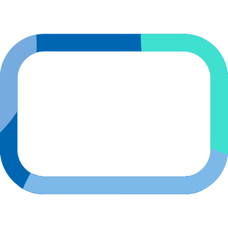

<<<<<<< HEAD
<a name="readme-top"></a>

<br />
<div align="center">
 <a href="https://github.com/marsian83/one-panel">
    
  </a>

  <h1 align="center">OnePanel</h1>

  <p align="center">
  A plug and play Admin Panel for your applications. Designed for developers.
    <br />
    <!-- <a href="https://github.com/othneildrew/Best-README-Template"><strong>Explore the docs »</strong></a> -->
    <!-- <br /> -->
    <br />
    <a href="https://one-panel.okeanos.solutions">View Demo</a>
    ·
    <a href="https://github.com/marsian83/one-panel/issues">Report Bug</a>
    ·
    <a href="https://github.com/marsian83/one-panel/issues">Request Feature</a>
  </p>
</div>

<!-- TABLE OF CONTENTS -->
<details>
  <summary>Table of Contents</summary>
  <ol>
    <li>
      <a href="#about-the-project">About The Project</a>
      <ul>
        <li><a href="#built-with">Built With</a></li>
      </ul>
    </li>
    <li>
      <a href="#getting-started">Getting Started</a>
      <ul>
        <li><a href="#prerequisites">Prerequisites</a></li>
        <li><a href="#installation">Installation</a></li>
      </ul>
    </li>
    <li><a href="#usage">Usage</a></li>
    <li><a href="#roadmap">Roadmap</a></li>
    <li><a href="#contributing">Contributing</a></li>
    <li><a href="#license">License</a></li>
    <li><a href="#contact">Contact</a></li>
    <li><a href="#acknowledgments">Acknowledgments</a></li>
  </ol>
</details>

<!-- ABOUT THE PROJECT -->

## About The Project

OnePanel provides easy to use solutions for adding an Admin Panel to any development project. Data is stored in MongoDB Databases and the connection URIs for each are accessible. The data is made accessible to the developer by exposing API endpoints.

-
- You shouldn't be doing the same tasks over and over like creating a README from scratch
- You should implement DRY principles to the rest of your life :smile:

Of course, no one template will serve all projects since your needs may be different. So I'll be adding more in the near future. You may also suggest changes by forking this repo and creating a pull request or opening an issue. Thanks to all the people have contributed to expanding this template!

Use the `BLANK_README.md` to get started.

<p align="right">(<a href="#readme-top">back to top</a>)</p>

### Built With

This section should list any major frameworks/libraries used to bootstrap your project. Leave any add-ons/plugins for the acknowledgements section. Here are a few examples.

- [![React][React.js]][React-url]
- [![Vue][Vue.js]][Vue-url]
- [![Angular][Angular.io]][Angular-url]
- [![Svelte][Svelte.dev]][Svelte-url]
- [![Laravel][Laravel.com]][Laravel-url]
- [![Bootstrap][Bootstrap.com]][Bootstrap-url]
- [![JQuery][JQuery.com]][JQuery-url]

<p align="right">(<a href="#readme-top">back to top</a>)</p>

<!-- GETTING STARTED -->

## Getting Started

This is an example of how you may give instructions on setting up your project locally.
To get a local copy up and running follow these simple example steps.

### Prerequisites

You will need to have the following dependencies installed on your system

- Golang [click here](https://go.dev/doc/install)
- NodeJs [click here](https://nodejs.org/en/download/releases)
- Access to a remote or local mongodb instance (connection URI)

### Installation

_Below is a rough step by step guide on how to get the project up and running_

1. Clone the repo
   ```sh
   git clone https://github.com/marsian83/one-panel
   ```
2. Install NPM packages for client

   ```sh
   cd client

   yarn
   ```

3. Install NPM packages for server

   ```sh
   cd server

   yarn
   ```

4. Install go modules for the following services
   ```
   /api
   /services/db_access
   /services/mockdata
   ```
5. Run the client
   ```sh
   cd client
   yarn dev
   ```
6. Run the server similarly and run the aforementioned Go services

<p align="right">(<a href="#readme-top">back to top</a>)</p>

## Usage

The landing page is very barebones and is

_For more examples, please refer to the [Documentation](https://example.com)_

<p align="right">(<a href="#readme-top">back to top</a>)</p>

<!-- ROADMAP -->

## Roadmap

- [x] Add Changelog
- [x] Add back to top links
- [ ] Add Additional Templates w/ Examples
- [ ] Add "components" document to easily copy & paste sections of the readme
- [ ] Multi-language Support
  - [ ] Chinese
  - [ ] Spanish

See the [open issues](https://github.com/othneildrew/Best-README-Template/issues) for a full list of proposed features (and known issues).

<p align="right">(<a href="#readme-top">back to top</a>)</p>

<!-- CONTRIBUTING -->

## Contributing

Contributions are what make the open source community such an amazing place to learn, inspire, and create. Any contributions you make are **greatly appreciated**.

If you have a suggestion that would make this better, please fork the repo and create a pull request. You can also simply open an issue with the tag "enhancement".
Don't forget to give the project a star! Thanks again!

1. Fork the Project
2. Create your Feature Branch (`git checkout -b feature/AmazingFeature`)
3. Commit your Changes (`git commit -m 'Add some AmazingFeature'`)
4. Push to the Branch (`git push origin feature/AmazingFeature`)
5. Open a Pull Request

<p align="right">(<a href="#readme-top">back to top</a>)</p>

<!-- LICENSE -->

## License

Distributed under the MIT License. See `LICENSE.txt` for more information.

<p align="right">(<a href="#readme-top">back to top</a>)</p>

<!-- CONTACT -->

## Contact

Your Name - [@your_twitter](https://twitter.com/your_username) - email@example.com

Project Link: [https://github.com/your_username/repo_name](https://github.com/your_username/repo_name)

<p align="right">(<a href="#readme-top">back to top</a>)</p>

<!-- ACKNOWLEDGMENTS -->

## Acknowledgments

Use this space to list resources you find helpful and would like to give credit to. I've included a few of my favorites to kick things off!

- [Choose an Open Source License](https://choosealicense.com)
- [GitHub Emoji Cheat Sheet](https://www.webpagefx.com/tools/emoji-cheat-sheet)
- [Malven's Flexbox Cheatsheet](https://flexbox.malven.co/)
- [Malven's Grid Cheatsheet](https://grid.malven.co/)
- [Img Shields](https://shields.io)
- [GitHub Pages](https://pages.github.com)
- [Font Awesome](https://fontawesome.com)
- [React Icons](https://react-icons.github.io/react-icons/search)

<p align="right">(<a href="#readme-top">back to top</a>)</p>
=======

>>>>>>> 58c2a911ec291fce13f4977dd1bd060f29ce2d2a
